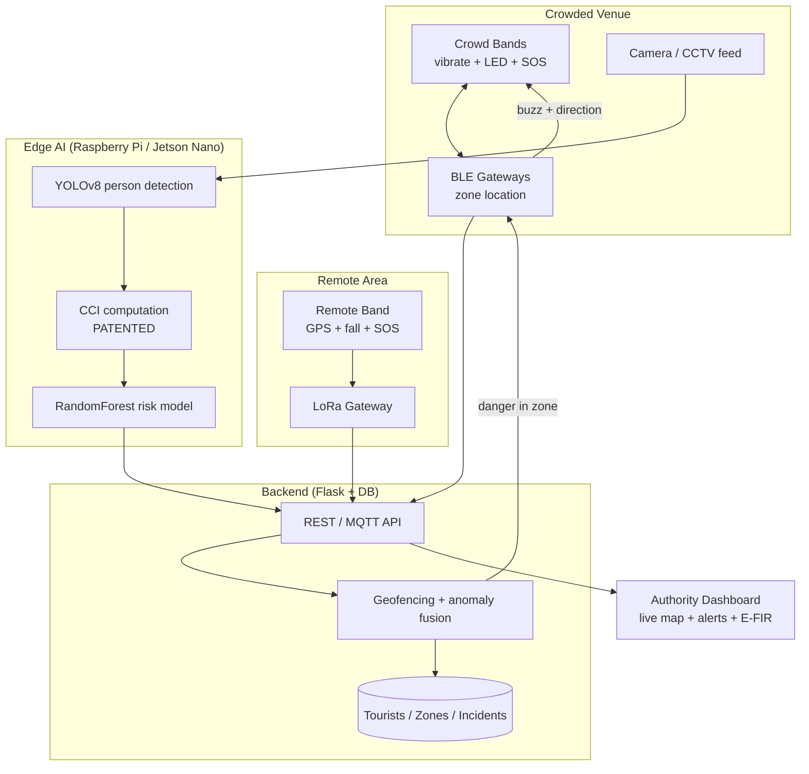

# SafeYatra — Smart Tourist Safety Monitoring System

> Working title — SafeYatra
> **InnoHack — Problem Statement DIOT-04 · SDG 10 & SDG 11**

**One-line pitch:** Everyone else protects the lone tourist lost in a remote area. We protect them there *and* in the deadly crush of a crowded festival, temple, or station — predicting danger *before* it happens, with a patented crowd-safety engine and a wearable cheap enough to give every visitor.

---

## 1. Problem

Tourist safety fails in two very different settings, and existing systems handle neither well.

- **Remote areas** (treks, forests, hills, beaches): tourists get lost, injured, or fall with no cell signal, and rescue is delayed because no one knows where they are.
- **Crowded areas** (festivals, temples, railway stations, melas): stampedes and crowd crushes injure and kill people every year, monitored only by manual CCTV that reacts *after* the crush has started.

Today's tools share the same weaknesses:
- **Reactive** — an incident report (FIR) is filed only once someone is already missing or hurt.
- **Cloud-dependent** — useless in exactly the low-connectivity places where remote tourists are most at risk.
- **Smartphone-gated** — they assume every tourist has a charged phone and an app, excluding the people most in danger in a crowd.
- **Blind to compression** — no system predicts the *build-up* of dangerous crowd pressure.

No single system covers both environments, works offline, predicts danger early, and is cheap enough to reach everyone. That gap is the SDG 10 (equitable safety access, including the isolated and the phone-less) and SDG 11 (safe public spaces) target.

---

## 2. Solution Overview

One platform, two coordinated hardware tiers, feeding a single authority dashboard.

1. **Low-cost crowd safety band** (~₹30–40 at-scale target, funded through venue entry fees) — a simple wearable that **vibrates** to warn of rising danger, uses **LEDs to point to the assigned safe exit**, and has an **SOS button**. Given to every visitor at the gate.
2. **Remote-trekker band + companion app** — a fuller GPS + LoRa band with fall detection and off-grid SOS, for high-risk isolated tourists.
3. **CCI crowd-safety engine** (your patented CrowdPulse module) — a fixed camera feed predicts stampede/compression risk *before* it turns critical, drives the band alerts, and tells authorities to open exits.
4. **Geofencing + multi-signal anomaly detection** — admins draw safe/danger zones; the system alerts on zone breach, fall, prolonged no-movement, or route deviation.
5. **Authority dashboard** — a live map of tourists, zones, and alerts; an incident log; and one-click auto-generated E-FIR for missing persons.
6. **Future enhancement (simulated in demo):** autonomous **drone dispatch** to a tourist's last known location for aerial search — the drone camera also feeds the CCI engine.

**The through-line:** *predictive, offline-capable, dual-environment, and affordable for everyone* — while competing teams typically solve one environment, reactively, over the cloud, for smartphone users only.

---

## 3. The Two-Band Model (core design idea)

The intelligence lives in the **venue infrastructure and backend**, not in the band. This is what makes a genuinely cheap band possible: the band is "dumb," the system is smart.

| | **Crowd Band** (mass, cheap) | **Remote Band** (trekkers) |
|---|---|---|
| **Environment** | Festivals, temples, stations | Treks, forests, hills |
| **Positioning** | BLE zone-level (which gateway hears it) | GPS |
| **Connectivity** | Local BLE gateways | LoRa (off-grid) |
| **Alerts to wearer** | Vibration + directional LEDs | Buzzer + app |
| **SOS** | Button → nearest gateway | Button → LoRa → dashboard |
| **Extra sensing** | — | Fall detection (accelerometer) |
| **Target cost** | ~₹30–40 at scale (reusable / deposit) | Higher — fewer units, high-value |
| **Funding** | Bundled into entry fee | Rented / issued for risky routes |

**Why no GPS on the crowd band:** GPS barely works indoors or in dense crowds anyway, and it's the single most expensive component. In a bounded venue, **BLE proximity is cheaper *and* more accurate** for "which zone is this person in." GPS belongs only on the remote band. This split is not a compromise — it's the correct engineering choice, and it cleanly maps the two bands to the two environments in the problem statement.

**Exit load-balancing (bonus novelty):** because the system knows each band's zone, it can route different zones to *different* exits via the directional LEDs — actively preventing bottlenecks instead of just detecting them.

---

## 4. System Architecture

---

## 5. Tech Stack

**Crowd band firmware**
- BLE SoC (nRF52 target; ESP32 for the prototype), C++ / Arduino
- Vibration motor, tactile SOS button, 2–3 directional LEDs

**Positioning & connectivity**
- BLE gateway anchors for indoor zone-level location (no GPS in venues)
- LoRa for remote/off-grid; WiFi/BLE locally; MQTT + HTTP/REST to backend

**Remote band firmware**
- ESP32 / Heltec ESP32-LoRa, NEO-6M GPS, MPU6050 accelerometer (fall detection)

**Backend** (reused from CrowdPulse)
- Python Flask + REST/MQTT API
- SQLite (hackathon) / PostgreSQL, for tourists, zones, incidents

**Crowd AI / vision** (reused from CrowdPulse)
- YOLOv8 person detection, **CCI computation (patented)**, scikit-learn RandomForest risk model, OpenCV
- Edge-deployed on Raspberry Pi 4 / NVIDIA Jetson Nano

**Anomaly detection**
- Rule-based fusion over motion + zone telemetry (fall, no-movement, route deviation, zone breach); optional lightweight ML later

**Dashboard / frontend** (reused from CrowdPulse)
- HTML / CSS / JS, Leaflet or Google Maps API (live map), Chart.js (trends)

**Digital ID**
- Offline QR-based tourist ID (blockchain / DigiLocker listed as future scope, not built)

---

## 6. Novelty (why we win)

- **Patented Crowd Compression Index (CCI)** — predictive stampede detection, already granted a patent, effectively impossible for other teams to replicate. This is the anchor of the whole pitch.
- **Infrastructure-smart, band-dumb model** — a genuinely ₹-scale wearable that alerts and guides **without GPS or a screen**, funded through entry fees so it reaches *every* visitor. This affordability/access angle is the SDG 10 win.
- **Dual-environment coverage** — cheap BLE band for crowds, GPS/LoRa band for remote; competitors solve only one.
- **Predictive, not reactive** — warns as crowd compression *rises* and guides people out before the crush, instead of reporting after the fact.
- **Offline-first** — LoRa for remote, local BLE for venues; works with zero cell coverage.
- **Exit load-balancing** — routes different zones to different exits to actively prevent bottlenecks, not just detect them.
- **Multi-signal anomaly fusion** — fall + inactivity + route deviation + zone breach, versus the single geofence-breach check most teams stop at.

---

## 7. Hardware Needed

**Crowd band — prototype unit**
- ESP32 or nRF BLE board (nRF52 is the production target; ESP32 is fine for the demo)
- Vibration motor
- Tactile push button (SOS)
- 2–3 LEDs (directional cue)
- Coin cell (CR2032) + simple wristband / enclosure

**BLE gateways** — 2–3 ESP32 boards acting as receivers for the demo

**Remote band**
- Heltec WiFi-LoRa-32 (V3)
- NEO-6M GPS module
- MPU6050 accelerometer/gyro (fall detection)
- Push button + buzzer
- LiPo battery + TP4056 charging module
- A second Heltec/LoRa board as the receiving gateway

**Crowd AI**
- USB webcam or Pi Camera
- Raspberry Pi 4 or NVIDIA Jetson Nano (runs YOLO + CCI edge inference)

**Shared**
- Laptop / server for backend + dashboard

**Optional (nice-to-have, don't let it eat your schedule)**
- MAX30102 heart-rate / SpO₂ sensor (vitals on the remote band)

---

## 8. Demo Flow (build the pitch around this — judges remember stories)

**Scene 1 — Remote:** a trekker's band detects a fall + no movement inside a danger zone → the alert relays over **LoRa with no cell signal** → the dashboard flashes the location → *(future)* a drone is dispatched to the last coordinate.

**Scene 2 — Crowded:** a festival camera feeds the **CCI engine** → the dashboard predicts stampede risk *while the crowd is still forming* → authorities are told to open exits → nearby **crowd bands buzz and light the arrow toward the assigned safe exit**.

One system, two deadly scenarios, predictive, patented. A clean 3-minute story.

---

## 9. What We Reuse from CrowdPulse (our head start)

- Flask backend and REST/MQTT plumbing
- The dashboard framework (extend into a live authority map)
- Edge-AI + ESP32/IoT experience
- The **CCI stampede-prediction engine** — the crown jewel, patented, dropped in as the crowd-safety module

We are **not** starting from zero, and we are **not** rebranding a camera project as a tourist tracker. CrowdPulse becomes one strong module inside a system architected specifically for the problem statement.

---

## 10. Honest Design Notes & Judge-Question Prep

- **Price:** ₹30–40 is the *at-scale target BOM*, not a proven or per-demo cost. The hackathon unit (built on ESP32) will cost more; realistic volume cost is ~₹50–100. Present it as "designed for scale" and be upfront — honesty beats a fake number.
- **"Use-and-throw" = e-waste**, which conflicts with SDG 11 sustainability. Better framing: a **refundable-deposit reusable band** (collected at exit, like a cloakroom token) for the electronic unit, plus an ultra-cheap **₹5 printed-QR wristband** as a truly disposable ID-only tier.
- **Scope discipline:** you cannot build all of this deeply. Lock the MVP spine — *band/app → backend → geofence + anomaly → dashboard live map + alert, plus CCI reused* — and make it **actually run live**. A working spine beats a slide deck of features.
- **Skip blockchain digital ID for the build.** The "official" version of this PS loves it, and most teams burn hours on it and demo nothing. Do a lightweight offline QR ID, check the box, and call blockchain a roadmap item.
- **Don't over-index on CrowdPulse.** This is tourist-safety-first; CCI is your best *feature*, not the headline.

---

## 11. Future Scope

- **Autonomous drone dispatch** to a tourist's last known location for aerial search (drone camera also feeds CCI). *Simulated in the current demo.*
- **Blockchain / DigiLocker digital tourist ID** with KYC and audit trail.
- **ML-based anomaly detection** on GPS/motion telemetry (beyond rule-based).
- **Vitals monitoring** (heart rate / SpO₂) on the remote band.
- **Multilingual + voice guidance** for accessibility.

---

## 12. SDG Alignment

- **SDG 10 (Reduced Inequalities):** safety reaches *everyone* — including phone-less visitors and isolated trekkers — via a wearable cheap enough to bundle into any entry fee.
- **SDG 11 (Sustainable Cities & Communities):** safer public spaces and mass gatherings through predictive crowd management and faster incident response.
